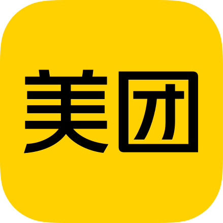

# 👋 Introduction

   

Hi guys, I'm **Hongming**. I am a `Back-End engineer` from Beijing, China. I'm currently working on  Meituan.  
I have some works with **C/C++**, **Rust** and **Go**, contact me if you have same interesting or some questions!

